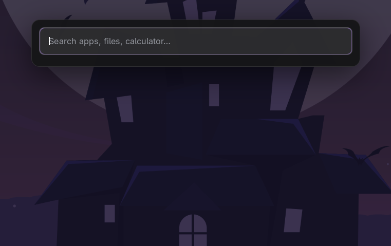
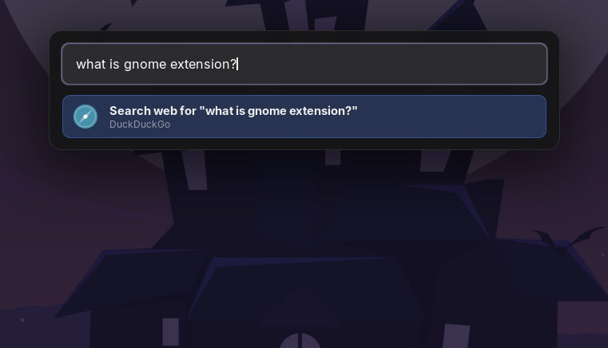
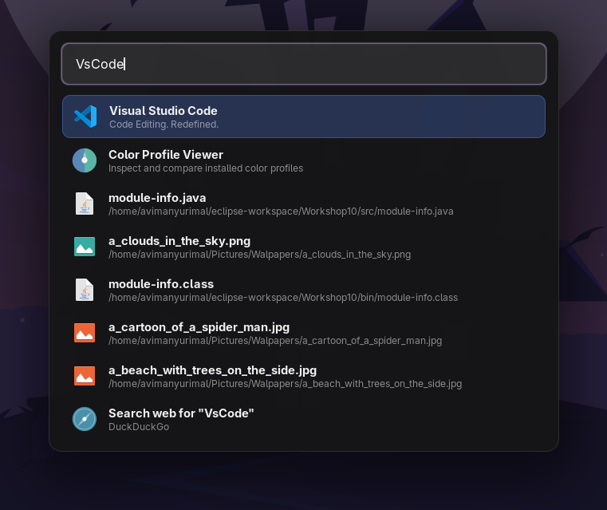
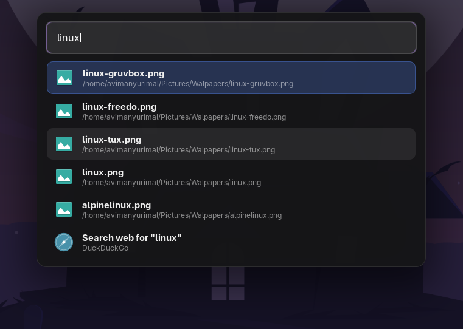
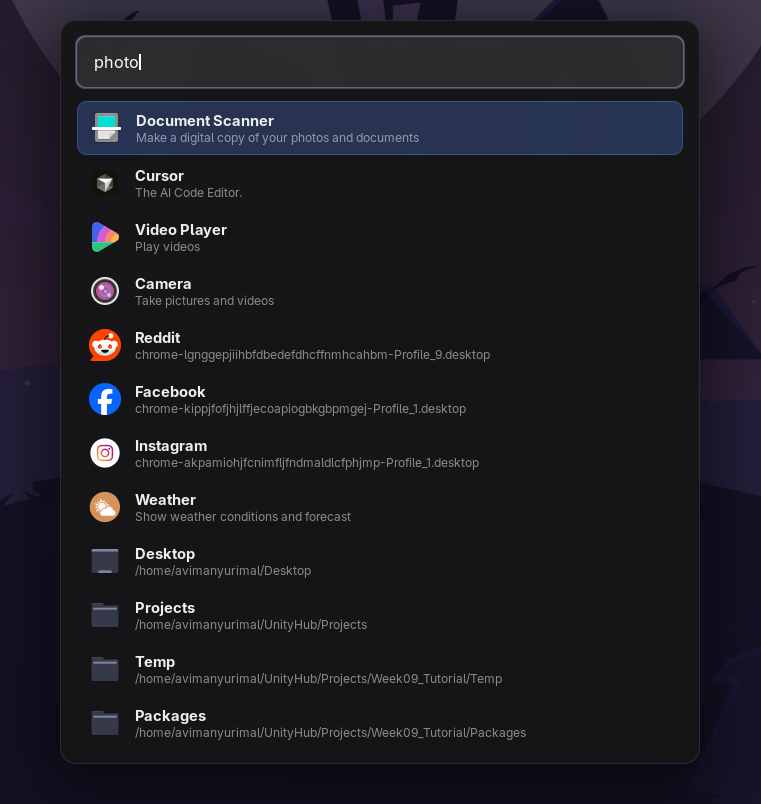
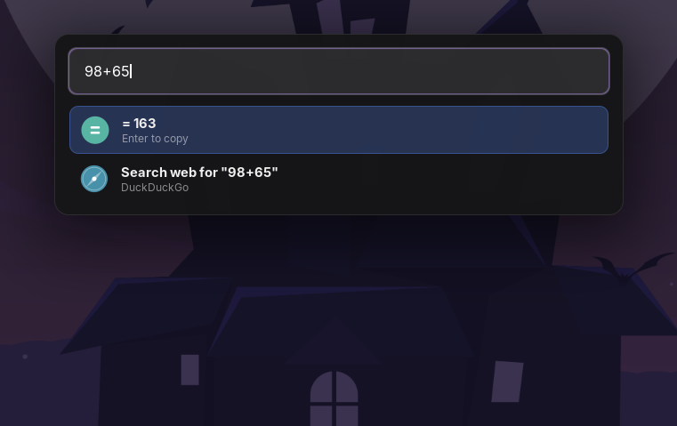

 

  <h3 align="center">Lightning GNOME Launcher</h3>
  
<strong>Lightning GNOME Launcher by Avimanyu Rimal</strong>

  

    <strong>License:</strong> GNU GPL v3 or later — <a href="./LICENSE">details</a>
  

## About

Lightning GNOME Launcher is a lightweight launcher shortcut for GNOME Shell.

### Features

- Minimal and lightweight design
- JS-only GNOME extension (no external Python process)
- Opens GNOME search instantly with `Super+Space`

## Screenshots

Selected screenshots of the launcher in use:

  
  

  
  

  
  

## License

Copyright (C) 2026 Avimanyu Rimal

This project is licensed under the GNU General Public License v3 or later.
See the LICENSE file for details.

## Author

Created by Avimanyu Rimal

